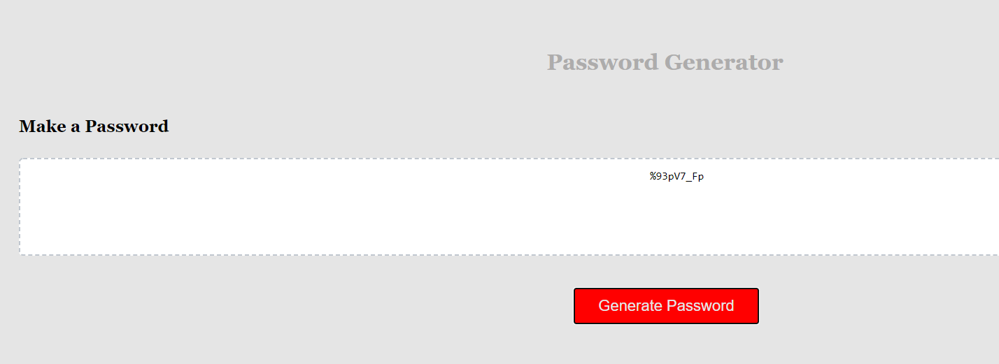

# Password-Generator-HW3

This is a homework assignment where we use javascript to create a strong password generator.

Alerts will let the user know what will be included in the password and the password generates to the page in the <textarea>



In the JavaScript file you will see where I have commented different requirements of the homework that are also found below.

Sources used outside of class information:

https://www.youtube.com/watch?v=9sT03jEwcaw
https://www.youtube.com/watch?v=duNmhKgtcsI
https://developer.mozilla.org/en-US/docs/Web/JavaScript/Reference/Global_Objects/parseInt
https://developer.mozilla.org/en-US/docs/Web/JavaScript/Reference/Global_Objects/Array/map

Special thanks to my tutor from wyzant.com

# 03 JavaScript: Password Generator

Create an application that generates a random password based on user-selected criteria. This app will run in the browser and feature dynamically updated HTML and CSS powered by your JavaScript code. It will also feature a clean and polished user interface and be responsive, ensuring that it adapts to multiple screen sizes.

If you are unfamiliar with special characters, take a look at [some examples](https://www.owasp.org/index.php/Password_special_characters).

## User Story

```
AS AN employee with access to sensitive data
I WANT to randomly generate a password that meets certain criteria
SO THAT I can create a strong password that provides greater security
```

## Acceptance Criteria

```
GIVEN I need a new, secure password
WHEN I click the button to generate a password
THEN I am presented with a series of prompts for password criteria
WHEN prompted for password criteria
THEN I select which criteria to include in the password
WHEN prompted for the length of the password
THEN I choose a length of at least 8 characters and no more than 128 characters
WHEN prompted for character types to include in the password
THEN I choose lowercase, uppercase, numeric, and/or special characters
WHEN I answer each prompt
THEN my input should be validated and at least one character type should be selected
WHEN all prompts are answered
THEN a password is generated that matches the selected criteria
WHEN the password is generated
THEN the password is either displayed in an alert or written to the page
```

The following image demonstrates the application functionality:


## Review

You are required to submit the following for review:

- The URL of the deployed application.

- The URL of the GitHub repository. Give the repository a unique name and include a README describing the project.

---

© 2019 Trilogy Education Services, a 2U, Inc. brand. All Rights Reserved.

Steps to making this project:

1. Declare variables

2. Define charachters allowable for passwords

3. Create conversion for Uppers

4. OnClick Pop-Up

5. Create function for password

6. Ask for user input

7. Make sure it is 8-128 charachters

8. Make sure user cannot just put nothing in and continue

9. Makes sure user knows password requirements in order to continue

10. If user uses all good options they can continue (Use process of elimination for combination of if else statements)

11. Make sure spaces are included so letters can be changed to Uppercase

12. Make space for password length

13. Use i to make random selection

14. Convert password array to a string!

15. Place result in required space
